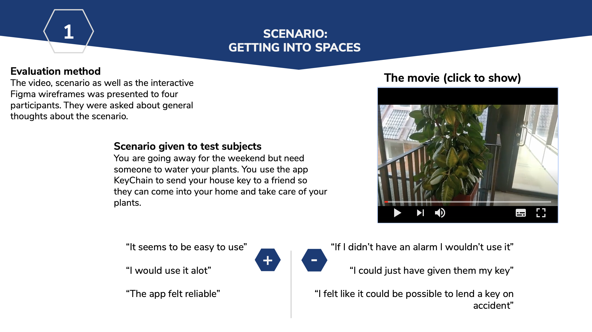

## Temporary digital keys

This is som fancy text about our project, look how fancy.

### Design challenge and approach

We have decided to use the design challenge Digital Authentication and Access in combination with the "Design for the real world"-approach.

 </dev>

### Oppertunity description and method approach

This is some nice text about the oppertunity we found and out chosen methods to find out more about the problem.

### Iteration 1
Information and pictures from the first iteration

### Iteration 2
Information and pictures from the second iteration with some fancy text to check if pictures work

### Iteration 3
Information and pictures from the third iteration

## Final result

This is the fancy final result, such wow.

